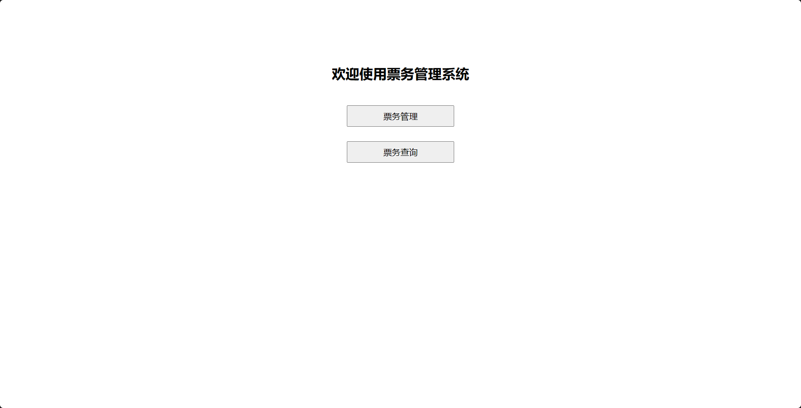
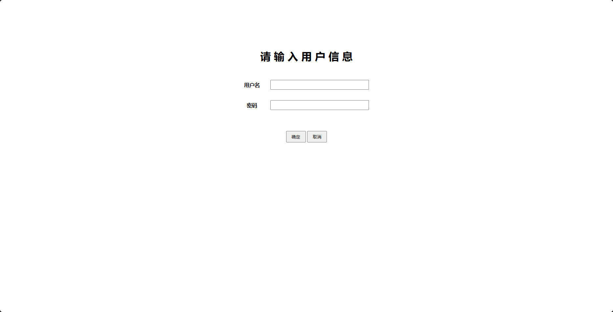
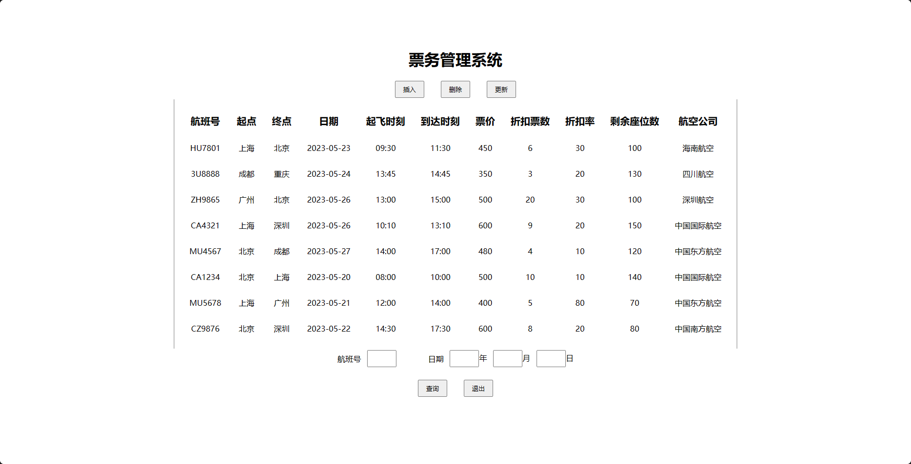
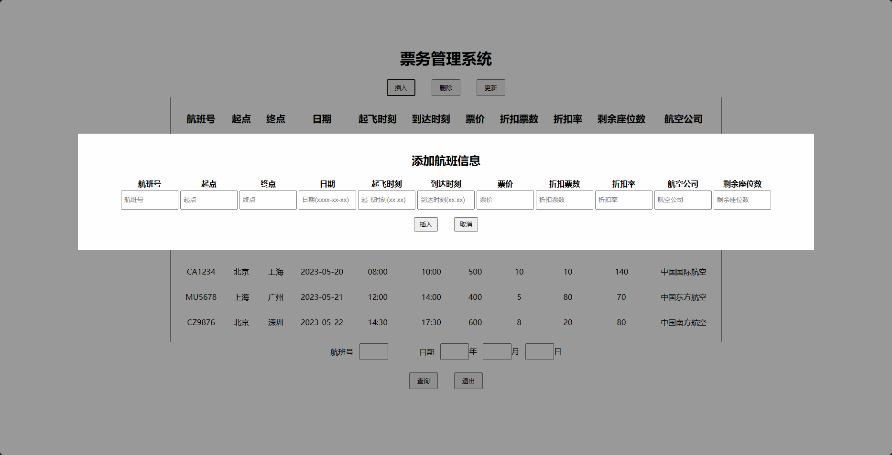
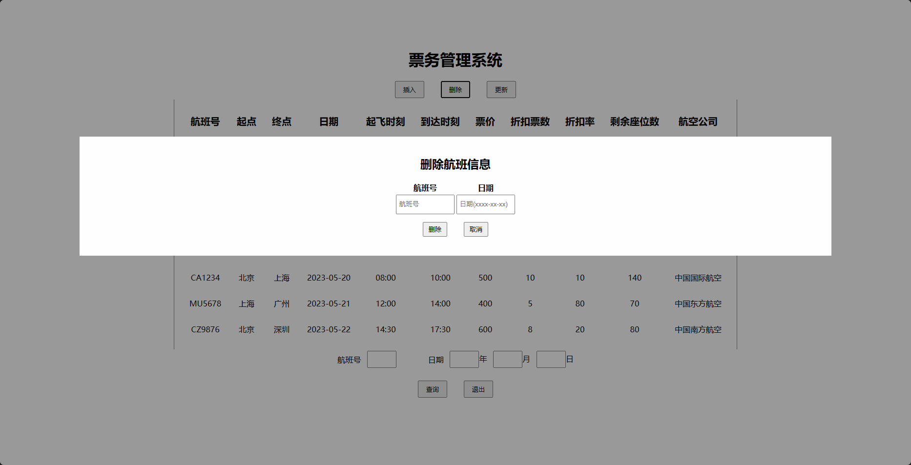
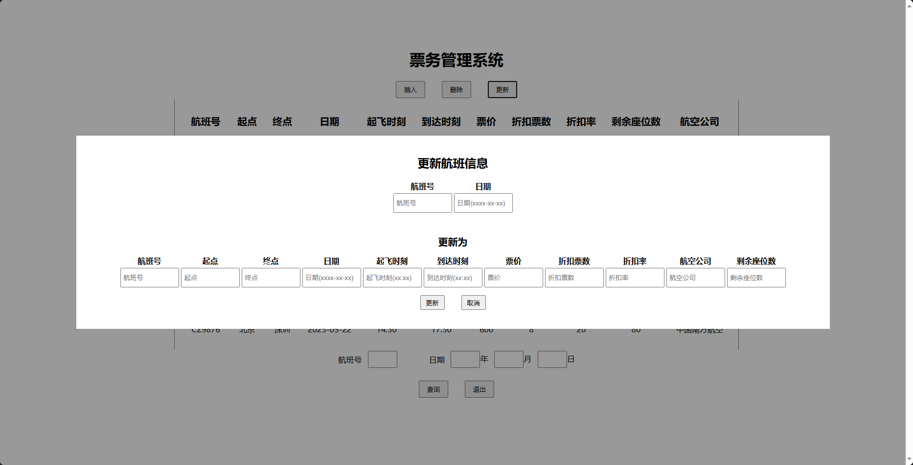
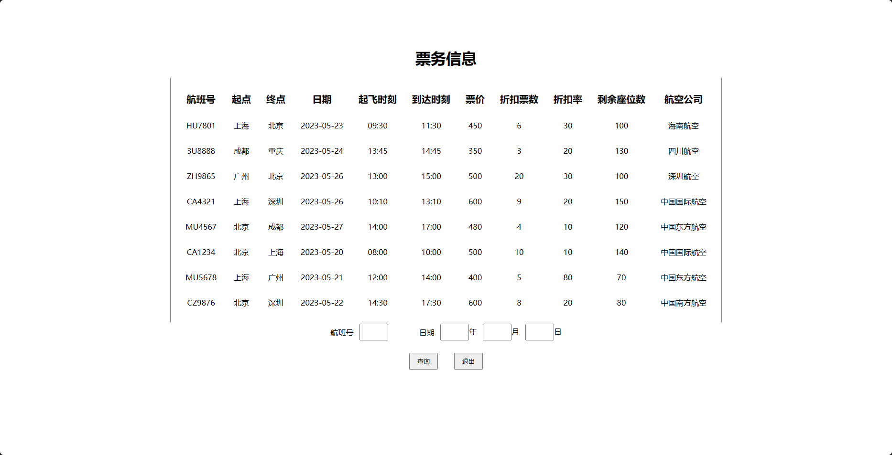
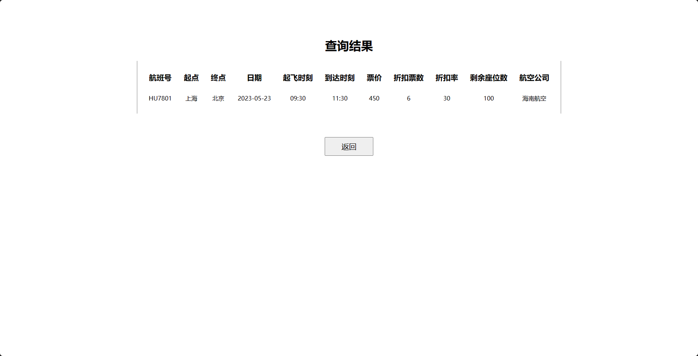

# MIS-AirTicket

### 一、项目描述

本项目为基于WAMP Server开发的民航票务信息管理系统，主要包括了仅提供给管理员的票务管理系统，和管理员与非管理员均可进入的票务查询系统。

### 二、项目介绍

#### 数据库(MySql)

用户表  Users :

```mysql
CREATE TABLE Users (
  Username VARCHAR(50) NOT NULL,
  Password VARCHAR(255) NOT NULL,
  Primary Key(Username, Password)
);

```

航班信息表  Flights :

```mysql
CREATE TABLE Flights (
  FlightNumber CHAR(8) NOT NULL,
  Date DATE NOT NULL,
  Origin VARCHAR(15),
  Destination VARCHAR(15),
  DepartureTime CHAR(6),
  ArrivalTime CHAR(6),
  TicketPrice FLOAT(8),
  DiscountTickets FLOAT(8),
  DiscountRate FLOAT(8),
  AvailableSeats INT(4),
  Airline VARCHAR(20),
  PRIMARY KEY (FlightNumber, Date)
);
```

#### 文件逻辑结构

```
main.html
    ├─managelogin.html
    │       ├─managelogin.php
    │       └─manage.php
    │              ├─insert.php
    │              ├─delete.php
    │              ├─update.php
    │              └─selectres.php
    └─select.php 
          └─selectres.php
```

1、`main.html`为系统的主界面。

2、`managelogin.html`为管理员登录界面

​    （1）`managelogin.php`为判断输入用户名和密码是否与数据库中匹配，匹配则跳转至`manage.php`。

​    （2）`manage.php`中包含了插入、删除、更新、查询操作的处理。

3、`select.php`为非管理员的票务查询界面，仅提供查询操作。

（注：其中`selectres.php`为`manage.php`和`select.php`共用。）

### 三、所用开发软件

WAMP Servers、Visual Studio Code

### 四、界面

#### 1、主界面



#### 2、（1）用户登录



#### （2）票务管理



#### （3）插入数据



#### （4）删除数据



#### （5）更新数据



#### 3、票务查询



#### 4、查询结果


